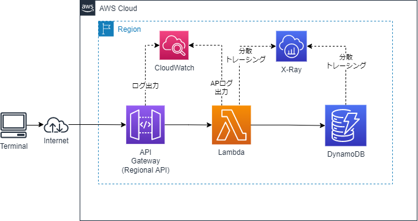

# AWS SAM サンプル

* API Gateway + Lambda/go + DynamoDBで、いろいろgoのライブラリを試しているサンプル（作成中）
## 構成イメージ


## 事前設定
* samconfig.tomlのs3_bucketの値をSAMの資材を格納するS3バケット名に修正します
* MakefleのSTACK_BUCKETの値も同じS3バケット名に修正します

## SAM ビルド
```sh
cd sam-app
sam build
# viper用のconfigを.aws-samフォルダにコピー（Windowsでのxcopyの例）
xcopy /I config .aws-sam\build\GetUsersFunction\config
xcopy /I config .aws-sam\build\PostUsersFunction\config

# Windowsにmakeをインストールすればmakeでもいけます
make 
```

## SAM デプロイ
```sh
# 1回目は
sam deploy --guided
# Windowsにmakeをインストールすればmakeでもいけます
make deploy_guided

# 2回目以降は
sam deploy
# Windowsにmakeをインストールすればmakeでもいけます
make deploy
```
## 実行
* curlコマンドを実行
```sh
# POSTコマンドの例
curl -X POST -H "Content-Type: application/json" -d '{ "name" : "Taro"}' https://42b4c7bk9g.execute-api.ap-northeast-1.amazonaws.com/Prod/users

# Getコマンドの例（users/の後にPOSTコマンドで取得したユーザIDを指定）
curl https://civuzxdd14.execute-api.ap-northeast-1.amazonaws.com/Prod/users/d4d6cb7f-7691-11ec-9520-1ee887dd490e
```

## スタック削除
```sh
# Windowsにmakeをインストールすればmakeでもいけます
make delete
```
