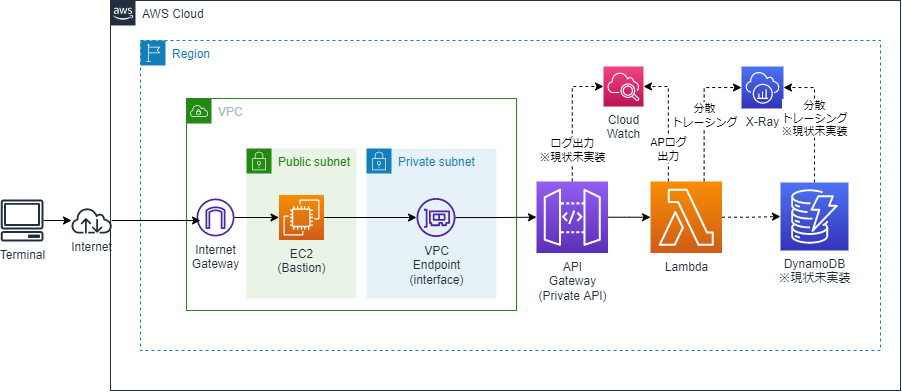

# Private API APIGatewayサンプルの下準備

## 構成イメージ


## 1. VPCおよびサブネット、InternetGateway等の作成
```sh
cd cfn
aws cloudformation validate-template --template-body file://cfn-vpc.yaml
aws cloudformation create-stack --stack-name Demo-VPC-Stack --template-body file://cfn-vpc.yaml
```

## 2. EC2(Bastion)用Security Groupの作成
```sh
aws cloudformation validate-template --template-body file://cfn-sg.yaml
aws cloudformation create-stack --stack-name Demo-SG-Stack --template-body file://cfn-sg.yaml
```
* 必要に応じて、接続元IPアドレス等のパラメータを指定
    * 「--parameters ParameterKey=TerminalCidrIP,ParameterValue=X.X.X.X/X」

## 3. EC2(Basion)の作成
```sh
aws cloudformation validate-template --template-body file://cfn-bastion-ec2.yaml
aws cloudformation create-stack --stack-name Demo-Bastion-Stack --template-body file://cfn-bastion-ec2.yaml
```
* 必要に応じてキーペア名等のパラメータを指定
    * 「--parameters ParameterKey=KeyPairName,ParameterValue=myKeyPair」

* CloudFormationの出力「BastionDNSName」に表示されるドメイン名の値でアクセスできます。

## 4. NAT Gatewayの作成とプライベートサブネットのルートテーブル更新
* 現状は作成不要。VPC内Lambdaを作成しインターネットに接続する場合に必要となる。

```sh
aws cloudformation validate-template --template-body file://cfn-ngw.yaml
aws cloudformation create-stack --stack-name Demo-NATGW-Stack --template-body file://cfn-ngw.yaml
```
## 5. AWS SAMでLambda/API Gatewayの実行
* SAMビルド
```sh
#sam-priv-appフォルダに戻る
cd ..
sam build
# Windowsにmakeをインストールすればmakeでもいけます
make
```

* 必要に応じてローカル実行可能
```sh
sam local invoke
sam local start-api
curl http://127.0.0.1:3000/hello
```

* SAMデプロイ
```sh
# 1回目は
sam deploy --guided
# Windowsにmakeをインストールすればmakeでもいけます
make deploy_guided

# 2回目以降は
sam deploy
# Windowsにmakeをインストールすればmakeでもいけます
make deploy
```

* EC2(Bation)へTeraTermでログインして、動作確認
```sh
curl https://5h5zxybd3c.execute-api.ap-northeast-1.amazonaws.com/Prod/hello/
```

## SAMのCloudFormationスタック削除
```sh
# Windowsにmakeをインストールすればmakeでもいけます
make delete
```

## その他のCloudFormationスタック削除
```sh
aws cloudformation delete-stack --stack-name Demo-NATGW-Stack
aws cloudformation delete-stack --stack-name Demo-SG-Stack
aws cloudformation delete-stack --stack-name Demo-Bastion-Stack
aws cloudformation delete-stack --stack-name Demo-VPC-Stack 

```